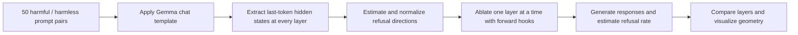

# LLM Refusal Mechanism Exploration

> **NTHU Mathematics Modeling Project — Conference Version (v1, completed by December 2025)**<br>
> A mechanistic interpretability study of refusal behavior in `google/gemma-2-2b-it` using residual-stream activation analysis and direction ablation.

[](#)
[](https://huggingface.co/google/gemma-2-2b-it)
[](#)
[](#)
[](#)

## TL;DR

This project investigates **where and how instruction-tuned language models encode refusal behavior**. Using 50 harmful/harmless prompt pairs, the v1 prototype extracts last-token hidden states from every layer of Gemma 2 2B IT, estimates a layer-wise refusal direction with a difference-of-means method, and removes the projection onto that direction during generation through PyTorch forward hooks.

The conference prototype produced qualitative evidence that ablating selected residual-stream directions can change refusal behavior. The current repository should be read as an **exploratory mechanistic-interpretability prototype**, not yet as a statistically validated safety benchmark: notebook outputs, held-out evaluation, confidence intervals, and classifier-based scoring still need to be added.

**Keywords:** AI Safety, LLM Alignment, Mechanistic Interpretability, Representation Engineering, Activation Engineering, Residual Stream, Direction Ablation, PyTorch Hooks, Hugging Face Transformers, PCA, Red Teaming, Model Evaluation, Reproducible ML

## Notebooks

| Version | Purpose | Launch |
|---|---|---|
| v1 — 2025 conference prototype | Original paired-prompt, activation extraction, visualization, and layer-ablation workflow | [Open v1 in Colab](https://colab.research.google.com/github/chelsietao/LLM-Refusal-Mechanism-Exploration/blob/main/LLM_Refusal_Mechanism_Exploration.ipynb) |
| v2 — reproducible evaluation | Train/validation/test separation, corrected layer alignment, random-direction control, bootstrap intervals, and safe artifacts | [Open v2 in Colab](https://colab.research.google.com/github/chelsietao/LLM-Refusal-Mechanism-Exploration/blob/codex/v2-colab/LLM_Refusal_Mechanism_Exploration_v2.ipynb) |

---

# Part I — Conference Research Prototype (as of 2025-12)

## 1. Project motivation

大型語言模型面對一般請求與有害請求時，可能產生完全不同的行為：前者正常回答，後者拒絕回答。本專題希望把這個現象從輸出文字拉回模型內部，探討：

> **模型的拒絕行為是否能由殘差流中的低維方向表示？若移除該方向，拒絕行為是否會隨之改變？**

這個問題連結了三個領域：

- **Mechanistic Interpretability：** 從模型內部 activation 理解行為形成的位置與方式。
- **Representation Engineering：** 以群體層級的表示方向監測或控制模型行為。
- **AI Safety Evaluation：** 測試安全微調形成的拒絕機制是否穩健。

本專題受到 Representation Engineering 與 refusal-direction 研究啟發，嘗試用一個可在 Google Colab T4 GPU 執行的小型白箱實驗，重現「抽取方向 → 逐層干預 → 觀察行為變化」的流程。

## 2. Research questions and hypotheses

### Research questions

1. 有害與無害指令的 hidden-state representations 是否會在特定層開始分離？
2. harmful 與 harmless activation 質心之差，能否作為拒絕方向的近似？
3. 從殘差流移除該方向的投影後，模型拒絕率是否下降？
4. 哪些 Transformer layers 對拒絕行為最敏感？

### Working hypotheses

- **H1 — Representation separation:** harmful 與 harmless prompts 在部分中間層具有可觀察的幾何分離。
- **H2 — Low-dimensional mediation:** 拒絕行為至少部分由一個低維、近似線性的方向所介導。
- **H3 — Causal intervention:** 若該方向具有因果作用，direction ablation 應系統性降低拒絕，而不只是改變 PCA 圖形。

## 3. Experiment scope

| Item | v1 configuration |
|---|---|
| Base model | `google/gemma-2-2b-it` |
| Model access | Hugging Face gated model |
| Prompt data | 50 harmful + 50 structurally paired harmless prompts |
| Representation | Last-token hidden state from every returned layer |
| Direction estimator | Difference of class means, followed by L2 normalization |
| Intervention | Residual-stream projection removal using forward hooks |
| Layer search | Sweep across the model's 26 Transformer layers |
| Initial evaluator | Refusal-keyword heuristic |
| Visualization | Layer-wise norm, cosine similarity, PCA, refusal-rate curve |
| Runtime target | Google Colab with an NVIDIA T4-class GPU |

The prompt pairs cover cyber abuse, fraud, weapons, violence, hate, privacy, and other unsafe intents. Each harmful prompt is paired with a superficially similar harmless request to reduce topic- and syntax-related confounding.

## 4. Methodology



### 4.1 Paired prompt construction

The prototype uses manually written paired prompts. For example, a harmful request about building an explosive is paired with a harmless request using similar phrasing about building a kite. This pairing attempts to isolate harmful intent from general sentence structure.

### 4.2 Activation extraction

After applying the model's chat template, the notebook performs a forward pass with hidden-state output enabled. For every returned layer, it records the representation at the final input-token position:

$$
h_i^{(l)} \in \mathbb{R}^{d},
$$

where $i$ is the prompt, $l$ is the layer, and $d$ is the hidden dimension.

### 4.3 Refusal-direction estimation

For each layer, the v1 estimator computes the difference between the harmful and harmless class centroids:

$$
v_{\text{raw}}^{(l)} = \mu_{\text{harmful}}^{(l)} - \mu_{\text{harmless}}^{(l)}.
$$

It then normalizes this vector:

$$
\hat{v}^{(l)} = \frac{v_{\text{raw}}^{(l)}}{\left\lVert v_{\text{raw}}^{(l)} \right\rVert_2}.
$$

The norm $\lVert v_{\text{raw}}^{(l)} \rVert_2$ is treated as an exploratory measure of layer-wise separation strength. This is not, by itself, proof of linear separability or causal mediation.

### 4.4 Direction ablation

A PyTorch forward hook removes each token activation's component along the chosen direction:

$$
h' = h - \left(h^\top \hat{v}\right)\hat{v}.
$$

The notebook applies this intervention to one Transformer layer at a time, generates responses for the harmful prompts, and compares the estimated refusal rate across layers.

### 4.5 Visualization and evaluation

The v1 notebook implements:

- layer-wise difference-vector magnitude;
- cosine similarity between each layer's direction and the final-layer direction;
- two-dimensional PCA projections of harmful and harmless activations;
- layer-by-layer refusal-rate plots after ablation;
- qualitative comparison of original and intervened generations.

## 5. v1 outcomes

The conference prototype completed the full experimental pipeline—from prompt formatting and activation extraction to direction construction and causal intervention code—and produced qualitative examples in which the model's response changed after ablation.

The two figures below are the visual artifacts retained from the original project presentation:


### What the v1 result supports

- The repo demonstrates an end-to-end white-box interpretability workflow on an open-weights instruction-tuned LLM.
- It identifies candidate layers whose representations or outputs appear more sensitive to refusal-direction ablation.
- It provides preliminary qualitative evidence consistent with the hypothesis that refusal has a low-dimensional component.

### What the v1 result does not yet establish

- It does not yet provide a held-out estimate of attack success rate or refusal-rate change.
- It does not establish that the extracted vector represents refusal rather than prompt topic, toxicity, or another correlated feature.
- It does not measure downstream capability degradation or over-refusal on benign prompts.
- It does not yet demonstrate transfer across models, datasets, languages, seeds, or prompt templates.

Because the committed notebook does not preserve executed outputs, exact numerical claims from the conference run should be regenerated before being cited as reproducible results.

## 6. Repository contents

```text
.
├── LLM_Refusal_Mechanism_Exploration.ipynb  # End-to-end Colab prototype
└── README.md                                 # Research record and roadmap
```

## 7. Reproduce the v1 notebook

### Prerequisites

- Python 3.10+
- NVIDIA GPU recommended; the original target was Google Colab T4
- A Hugging Face account with access to `google/gemma-2-2b-it`
- A Hugging Face read token supplied interactively—never commit tokens to git

### Run in Colab

[](https://colab.research.google.com/github/chelsietao/LLM-Refusal-Mechanism-Exploration/blob/main/LLM_Refusal_Mechanism_Exploration.ipynb)

Or install the notebook dependencies in a GPU environment:

```bash
python -m pip install torch transformers accelerate huggingface_hub \
  matplotlib seaborn numpy pandas scikit-learn tqdm
```

Run the notebook from top to bottom. Cells that fall back to simulated data are intended only for plotting demonstrations; they must not be used when reporting experimental results.

## 8. Technical decisions and known limitations

| Decision in v1 | Benefit | Limitation / risk |
|---|---|---|
| Manually paired prompts | Easy to inspect and explain | Small sample; possible author and topic bias |
| Last-token activation | Simple fixed extraction point | May miss token-level evolution and padding/template effects |
| Difference of means | Interpretable and inexpensive | No train/test separation; sensitive to confounders |
| PCA visualization | Intuitive geometric view | A 2D projection cannot prove high-dimensional separability |
| Keyword refusal detector | Fast, transparent baseline | False positives/negatives; cannot reliably score harmful compliance |
| One-layer-at-a-time hook | Supports localized causal tests | Does not test distributed or multi-layer mechanisms |
| Greedy generation | Reduces sampling variance | Does not measure robustness across decoding strategies |

## 9. Safety and responsible use

This repository studies weaknesses in refusal mechanisms for **defensive AI-safety research, interpretability, and evaluation**. Removing refusal directions can weaken model safeguards. Experiments should therefore use controlled environments, avoid operationally harmful outputs, retain audit logs, and report aggregate metrics or redacted examples when possible.

---

# Part II — Expansion Roadmap

The next version should turn the conference notebook into a reproducible research repository with stronger causal evidence and standardized safety evaluation.

## Recommended research sequence

### Phase 1 — Reproducibility and software engineering

- Refactor notebook logic into `src/` modules and configuration files.
- Pin dependencies and record model revision, hardware, seeds, prompt template, and decoding settings.
- Save metrics to CSV/JSON and figures to versioned artifact directories.
- Add CLI entry points, structured logging, unit tests, linting, and GitHub Actions CI.
- Remove all automatic simulated-data fallbacks from result-producing code.

**Interview/ATS signals:** Python, PyTorch, Hugging Face Transformers, experiment tracking, configuration management, unit testing, CI/CD, reproducible machine learning.

### Phase 2 — Valid evaluation

- Split direction-estimation prompts from held-out evaluation prompts.
- Report baseline refusal rate, post-ablation refusal rate, attack success rate, over-refusal, and benign capability retention.
- Replace keyword-only scoring with a validated classifier or rubric-based judge plus a human-audited sample.
- Report bootstrap confidence intervals, effect sizes, and sensitivity across random seeds.
- Add negative controls: random directions, shuffled labels, norm-matched directions, and unrelated semantic directions.

**Interview/ATS signals:** experimental design, causal inference, statistical analysis, bootstrap confidence intervals, model evaluation, data validation, responsible AI.

### Phase 3 — Mechanistic depth

- Compare difference-of-means with logistic probes, linear SVMs, PCA/LDA directions, and sparse autoencoder features.
- Measure token-wise projection trajectories rather than only the final input token.
- Run activation patching and multi-layer interventions to distinguish correlation from mediation.
- Test both ablation and direction addition; the latter should induce over-refusal on benign prompts if the direction is causally meaningful.
- Quantify collateral effects with perplexity and general-capability benchmarks.

**Interview/ATS signals:** mechanistic interpretability, activation patching, probing classifiers, representation learning, sparse autoencoders, ablation studies.

### Phase 4 — Generalization

- Compare base and instruction-tuned variants and multiple open model families/sizes.
- Evaluate cross-layer, cross-model, and cross-dataset transfer of refusal directions.
- Add multilingual prompt pairs, including Traditional Chinese and English.
- Compare standard, adversarial, and out-of-distribution prompts using a documented threat model.
- Integrate a standardized benchmark such as HarmBench or JailbreakBench where licensing and safety constraints permit.

**Interview/ATS signals:** benchmark design, multilingual NLP, transfer learning, red teaming, robustness evaluation, AI alignment.

### Phase 5 — Portfolio-quality delivery

- Publish a short research report with an explicit methods/results/limitations structure.
- Add an experiment dashboard or static result explorer.
- Package a safe demo that visualizes activation projections without returning harmful instructions.
- Release reproducible commands and a model card / data card describing intended use and risks.

## Suggested measurable v2 deliverables

| Deliverable | Acceptance criterion |
|---|---|
| Reproducible pipeline | One command reproduces metrics and figures from a clean environment |
| Held-out evaluation | No prompt used to estimate a direction appears in the test set |
| Statistical report | Effect sizes and 95% bootstrap confidence intervals are included |
| Control experiments | Random, shuffled-label, and norm-matched controls are reported |
| Generalization matrix | At least 2 model families × 2 datasets × 2 languages |
| Capability/safety trade-off | Both harmful compliance and benign performance are measured |
| Automated quality checks | Unit tests and CI pass on every pull request |

## Resume-ready framing after v2 is complete

Use quantified bullets only after the pipeline has regenerated and saved the underlying evidence. A strong format would be:

> Built a reproducible PyTorch/Hugging Face mechanistic-interpretability pipeline to extract and causally ablate refusal directions across **[N] models** and **[M] prompts**; evaluated safety/capability trade-offs with held-out benchmarks, negative controls, and bootstrap confidence intervals, reducing **[metric] by [X%]** while retaining **[Y%]** benign-task performance.

Do not fill the bracketed values until the experiment artifacts are committed and independently reproducible.

## References

1. Zou et al., [*Representation Engineering: A Top-Down Approach to AI Transparency*](https://arxiv.org/abs/2310.01405), 2023.
2. Arditi et al., [*Refusal in Language Models Is Mediated by a Single Direction*](https://arxiv.org/abs/2406.11717), 2024.
3. Chao et al., [*JailbreakBench: An Open Robustness Benchmark for Jailbreaking Large Language Models*](https://arxiv.org/abs/2404.01318), 2024.

## Author and context

- **Project type:** National Tsing Hua University mathematics modeling project
- **v1 milestone:** Conference presentation completed by December 2025
- **Research focus:** LLM safety, refusal mechanisms, representation engineering, and mechanistic interpretability
